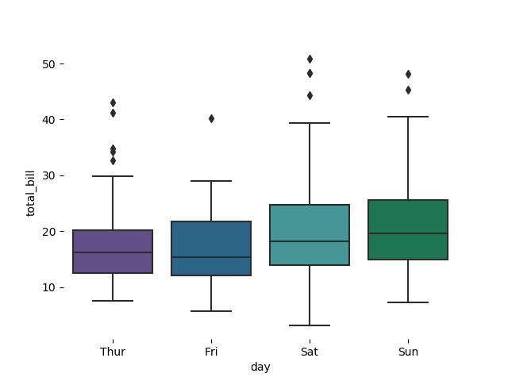
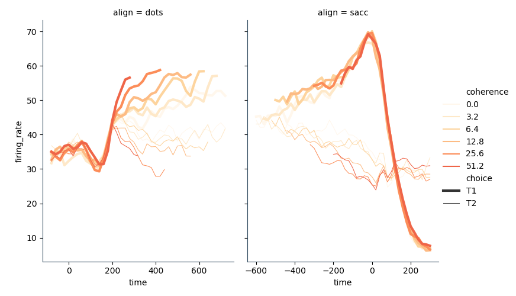
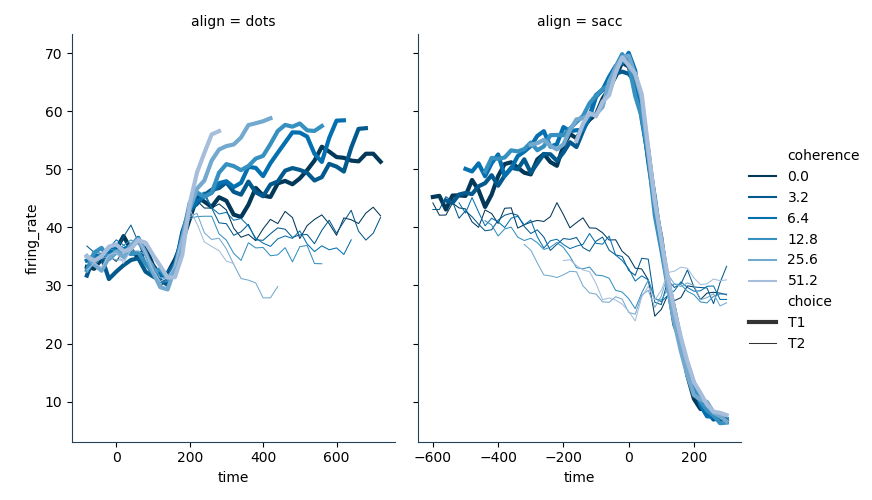
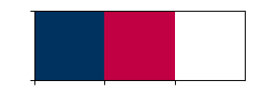

Getting started
===============

Installation
------------

This package has some dependencies (all solved by conda):

- argh
- matplotlib
- palettable

For the moment clone the repo and run `pip install -e .`

Example usage
-------------

All examples are in the example.py file inside the test folder.

Reset matplotlib parameters
+++++++++++++++++++++++++++

Use the `settings.reset_rc_params()` function to set the fundamental 
behaviour of your plots::

    t=1/10*np.linspace(0,10,100)
    x=np.sin(2*np.pi*t)

    # Default mpl parameters
    f,ax=plt.subplots(1)
    ax.plot(t,x)
    plt.grid(True)

    # Reset parameters
    stracolors.settings.reset_rc_params()

    f,ax=plt.subplots(1)
    ax.plot(t,x)
    plt.grid(True)

Look how the appearance changes with the default settings.

    .. image:: docs/examples/plot.png
        :width: 49 %
    .. image:: docs/examples/plot_reset.png
        :width: 49 %

Palette choice
+++++++++++++++

There are different types of palettes available: sequential, divergent, qualitative and paired. 
For all these palettes the number of colors can be specified so that the correct list
of colors is returned. 

On top of that, binary palettes can be chosen and two colors are returned.

**Qualitative colors**::

    tips = sns.load_dataset("tips")

    # Qualitative colors 
    qual=stracolors.calls.call_palette('qualitative', number_of_colors=4)

    f,ax=plt.subplots(1)
    sns.boxplot(x="day", y="total_bill",
        data=tips, palette=qual, ax=ax)

**Pairs and triplets**::

        # Paired Colors
        paired=stracolors.calls.call_palette_paired(number_of_classes=1)

        f,ax=plt.subplots(1)
        sns.boxplot(x="day", y="total_bill", hue='smoker',
            data=tips, palette=paired, ax=ax )

        # Two classes, three examples each

        pal=stracolors.calls.call_palette_triple(number_of_classes=2)

        f,ax=plt.subplots(1)
        plt.plot(t,y1, color=pal[0])
        plt.plot(t,y2, color=pal[1])
        plt.plot(t, y3, color=pal[2])

        plt.plot(t,ya, color=pal[3])
        plt.plot(t,yb, color=pal[4])
        plt.plot(t, yc, color=pal[5])

Mutiple classes:

    .. image:: docs/examples/boxplot_paired.png
        :width: 49 %
    .. image:: docs/examples/plot_triple.png
        :width: 49 %

**Sequential palettes, Normal red palette with 6 colors**::

    dots = sns.load_dataset("dots")

    # Define a palette to ensure that colors will be
    # shared across the facets: sequential red
    palette = dict(zip(dots.coherence.unique(),
                    stracolors.calls.call_palette('sequential',number_of_colors=6)))

    # Plot the lines on two facets
    g1=sns.relplot(x="time", y="firing_rate",
                hue="coherence", size="choice", col="align",
                size_order=["T1", "T2"], palette=palette,
                height=5, aspect=.75, facet_kws=dict(sharex=False),
                kind="line", legend="full", data=dots)

    

**Normal blue reversed palette**::

    # Define a palette to ensure that colors will be
    # shared across the facets: sequential blue reversed
    palette = dict(zip(dots.coherence.unique(),
                    stracolors.calls.call_palette('sequential',number_of_colors=6, shade='blue', reverse=True)))
    # Plot the lines on two facets
    g1=sns.relplot(x="time", y="firing_rate",
                hue="coherence", size="choice", col="align",
                size_order=["T1", "T2"], palette=palette,
                height=5, aspect=.75, facet_kws=dict(sharex=False),
                kind="line", legend="full", data=dots)

    

Available palettes
------------------

University of Edinburgh colors
++++++++++++++++++++++++++++++

Qualitative
+++++++++++

Binary
++++++

Palette binary colored and black&white

    .. image:: docs/palettes/palette_binary_color.png
        :width: 49 %
    .. image:: docs/palettes/palette_binary_bw.png
        :width: 49 %

Divergent
++++++++++

Sequential
+++++++++++

Sequential red (light, normal, dark):

    .. image:: docs/palettes/palette_sequential_red_light.png
        :width: 32 %
    .. image:: docs/palettes/palette_sequential.png
        :width: 32 %
    .. image:: docs/palettes/palette_sequential_red_dark.png
        :width: 32 %

Sequential blue (light, normal, dark):

    .. image:: docs/palettes/palette_sequential_blue_light.png
        :width: 32 %
    .. image:: docs/palettes/palette_sequential_blue.png
        :width: 32 %
    .. image:: docs/palettes/palette_sequential_blue_dark.png
        :width: 32 %

Pairs and Triplets
++++++++++++++++++

Commands
--------

Use the show-choices command to save the major examples of palettes
available. 

`stracolors show-choices output-folder`
  
Current Version: 1.0.0-dev